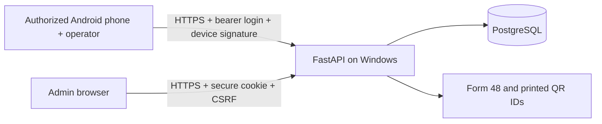

# Architecture and attendance rules



## Roles and workflow

Administrators manage employees, profiles, IDs, accounts, devices, corrections, field duty, settings, and reports. Operators authenticate on the shared phone. Employee accounts are outside this MVP; employees present their IDs and obtain DTRs from the admin.

The operator selects an action explicitly; the reference schedule never chooses or changes it automatically. The phone identifies the QR using a signed read request, displays the employee's name and photo, and asks for confirmation. Canceling records nothing. After confirmation, a separate signed request saves the server time. No photo means the operator must compare the person against the printed ID.

Times are stored in UTC and grouped/displayed in Asia/Manila. One employee has at most one active time per date and action. Missing scans are displayed as “No scan recorded”; a future date is pending. There are no lateness or absence calculations. The date changes at Philippine midnight.

## Data

| Table | Purpose |
|---|---|
| users | Admin/operator credentials, activation and session version |
| employees | Employee number, name, position, photo, active status, random QR |
| devices | Enrolled public key and revocation status |
| enrollments | Hashed one-use authorization codes, expiring after ten minutes |
| attendance | Four daily slots, original time, current time, version, source and void status |
| scan_receipts | Device/operator-bound request IDs for safe retries |
| field_duties | One daily assignment summary per employee with period/location/purpose |
| month_locks | Finalization status per office month |
| audit | Actor, timestamp, reason, before/after values |
| office_settings | Reference schedule and report signatory |

All attendance-changing transactions take a PostgreSQL row lock on the office-settings row. With this small office, serialization is inexpensive and ensures duplicate handling, single-phone enrollment and month locks stay consistent. Unique constraints provide another protection. SQLite exists solely for disposable tests; concurrency readiness must be validated with PostgreSQL.

Admin changes use record versions to reject stale edits. Manual times require a reason and cannot be in the future. Voiding does not delete the original record. A later scan or correction can fill a voided slot, preserving its original time and full history. An old scan receipt does not claim success after an admin changes its version.

Field duty covers a full day, morning, or afternoon. It is recorded from existing office approval, without another employee submission form. It never creates times, erases existing scans, or proves hours worked. For multiple locations on one day, use one assignment summary. PDFs add a supplementary field-duty page rather than inserting invented times into Form 48.

Only completed months can be finalized. Finalization applies to all employees for that month and blocks corrections, field-duty edits, voiding and scans. Reopening requires a reason. Report-signatory and office settings are current values rather than signed report snapshots.

## Device protocol

The Android application creates an RSA-2048 key in Android Keystore. The private key is nonexportable through the app API; hardware protection depends on the phone. Backups of app data are disabled. An admin issues a one-time enrollment code; the operator submits its public key. The server refuses a second active phone until the first is revoked.

Each identify/save request carries a UUID, client timestamp in milliseconds, QR identifier, action, device ID, and Base64 signature. The UTF-8 message is:

```text
attendance.scan.v1
<request_id>
<timestamp_ms>
<qr_code>
<action>
```

Identification uses `attendance.identify.v1` so its signature cannot authorize a save. Signing is SHA256withRSA / PKCS#1 v1.5. New requests must be within 90 seconds of server time; attendance still uses server time. An identical authenticated retry can confirm an existing receipt later. Signatures, receipt ownership, enrollment status, employee activation and month locks are checked on the server.

Before sending a save, the phone durably stores its signed packet, operator ID and server address. It stores no login password/token/private key in preferences. If a response is lost, new scans pause; retrying uses the exact original packet. App restart retains it. The original operator can log in again and resolve it. Definitive 404/409/422 rejection clears it; ambiguous transport/5xx/auth failures retain it. An admin can inspect attendance and explicitly resolve the pending request if the phone cannot confirm it.

## Security and deployment boundaries

- Argon2 password hashing; twelve-character minimum for new passwords.
- Expiring JWT sessions. Account disable/password reset invalidates existing sessions.
- Web sessions use HttpOnly, SameSite=Strict cookies plus CSRF verification. No cross-origin API access is enabled.
- Operator bearer authentication never grants dashboard access. Device ID alone grants nothing.
- Ten failed login attempts per source address within five minutes. Run one API worker; this small-office limiter is process-local.
- Release Android builds require HTTPS and a separately configured release signing key. Debug builds alone permit HTTP for disposable local tests.
- User-installed office certificate authorities are trusted by the managed phone, alongside system roots. Certificate verification is never disabled.
- PostgreSQL is accessible only on the server. The website does not offer QR submission.
- Printed QR IDs can be copied; physical operator verification remains necessary.

This initial schema uses SQLAlchemy `create_all` for a new database. It does not alter existing tables. Future schema changes need explicit migrations and a backup first; do not assume restarting the app upgrades a populated database.
